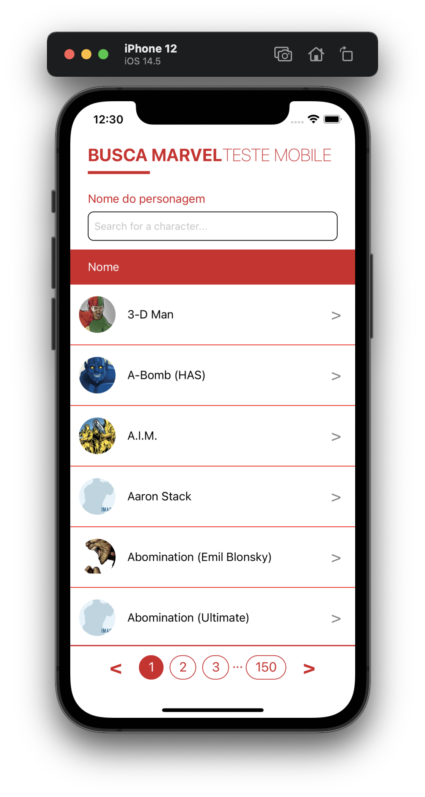
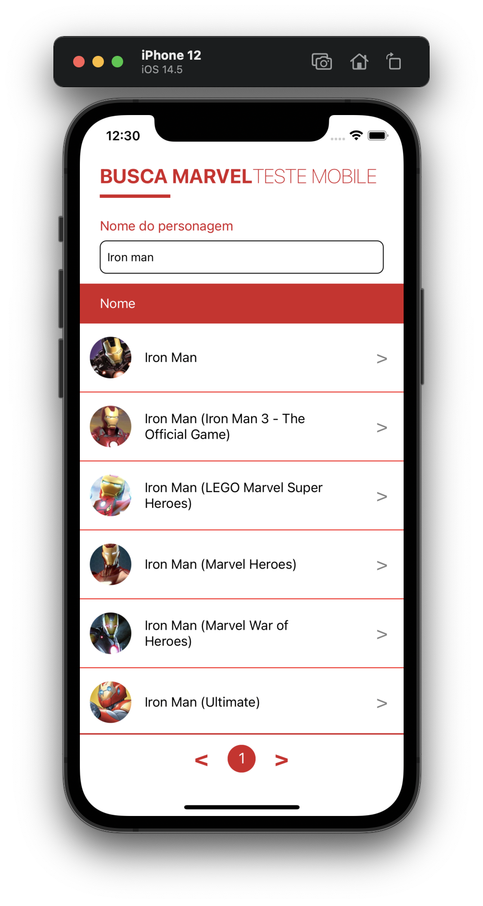
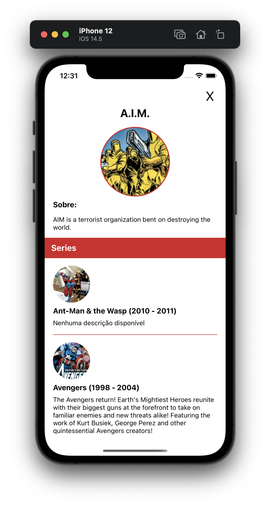

# MarvelApp

Esse aplicativo foi feito como parte do processo seletivo da Pontomais para a vaga de dev mobile.
Consiste em um client mobile feito com React Native para consumir a Marvel API para:

1. Listar heróis com campo de busca

2. Detalhes do herói selecionado na listagem, com seus eventos e series

O processo de TDD foi seguido à risca, escrever o código de produção após os testes.
O único component que não foi testado foi o App.tsx que faz a composição da aplicação,
os outros components e services foram feitos com testes primeiro. Para os testes foram utilizados Jest e React Native Testing Library.

Para que a aplicação consiga fazer as requisições para a Marvel API,
é necessário criar um arquivo **.env** com as _PUBLIC_KEY_ e _PRIVATE_KEY_
disponíveis em https://developer.marvel.com/

## Próximos passos:

1. Validar a composição em App.tsx com testes unitários
2. Habilitar CI com o travis
3. Adicionar splash screen do android
